<!--
 * @Author: Amos Cao
 * @Date: 2023-09-19 21:28:49
 * @LastEditors: Amos Cao
 * @LastEditTime: 2023-09-20 17:09:27
 * @Description: sad代码dog
-->
## 直方图
对一幅灰度图像，其直方图反映了该图像中不同灰度级出现的统计情况。
其中横轴表示图像的各灰度级，纵轴表示图像中各灰度级像素的个数。

## 直方图均衡化
一些拍摄得到的图片，我们从其直方图可以看出，它的分布是集中于某些灰度区间，这导致人在视觉上感觉这张图的对比度不高。所以，对于这类图像，我们可以通过直方图均衡技术，将图像的灰度分布变得较为均匀，从而使得图像对比度增大，视觉效果更佳。

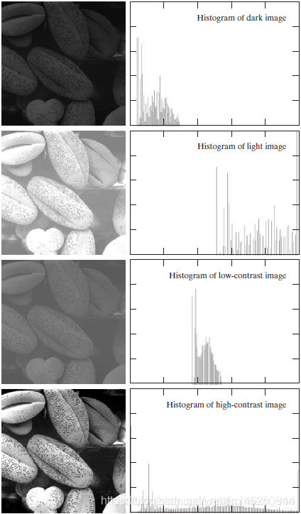

直方图均衡化的作用是图像增强。

### 均衡过程中的条件
1. 像素无论怎么映射，一定要保证原来的大小关系不变，较亮的区域，依旧是较亮的，较暗依旧暗，只是对比度增大，绝对不能明暗颠倒；
2. 如果是八位图像，那么像素映射函数的值域应在0和255之间的，不能越界。

累积分布函数是个好的选择，因为累积分布函数是单调增函数（控制大小关系），并且值域是0到1（控制越界问题），所以直方图均衡化中使用的是累积分布函数。

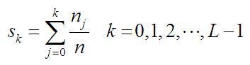

其中，n是图像中像素的总和，nk是当前灰度级的像素个数，L是图像中可能的灰度级总数。

### 例子
假设有如下图像：

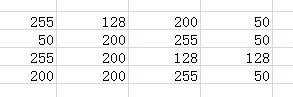

得图像的统计信息如下图所示，并根据统计信息完成灰度值映射：

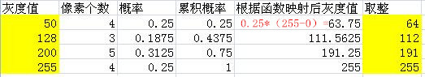

映射后的图像如下所示：

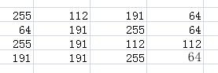

视频 https://www.bilibili.com/video/BV1RF41177xo/?spm_id_from=333.788&vd_source=e696436215120369d81a858fb5dbb3d7

## 直方图匹配（规定化）
就是通过一个灰度映像函数，将原灰度直方图改造成所希望的直方图。所以直方图修正的关键就是灰度映像函数。

直方图均衡化能自动增强图像的整体对比度，但是往往结果难以受到控制。实际中常常需要增强某个特定灰度值范围内的对比度或使图像灰度值的分布满足特定需求。这个时候使用直方图规定化会有较好的结果。

直方图规定化就是要调整原始图像的直方图去逼近规定的目标直方图。M为原始图的灰度级数，N为目标图的灰度级数，且M>N。

### 步骤
1. 根据直方图均衡化原理，对原图像的直方图进行灰度均衡化处理。
2. 按照目标图像的概率密度函数Pz(z) ,求解目标图像进行均衡化处理的变换函数G(z);
3. 用原始图像均衡化中得到的灰度级s代替v,求解逆变换z = G−1(s).

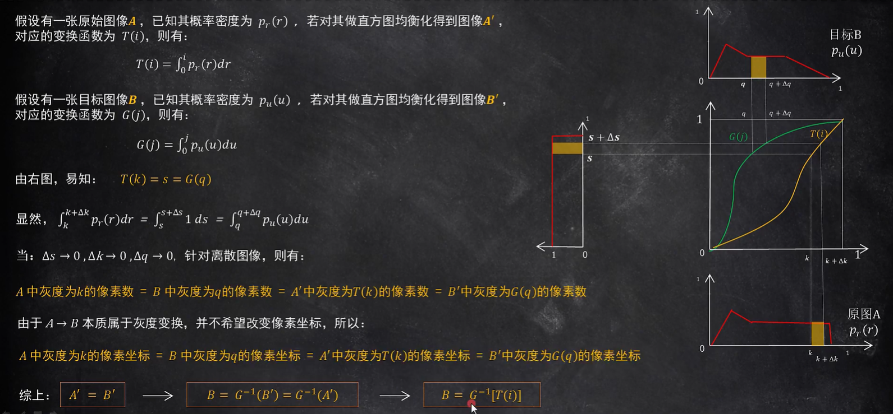

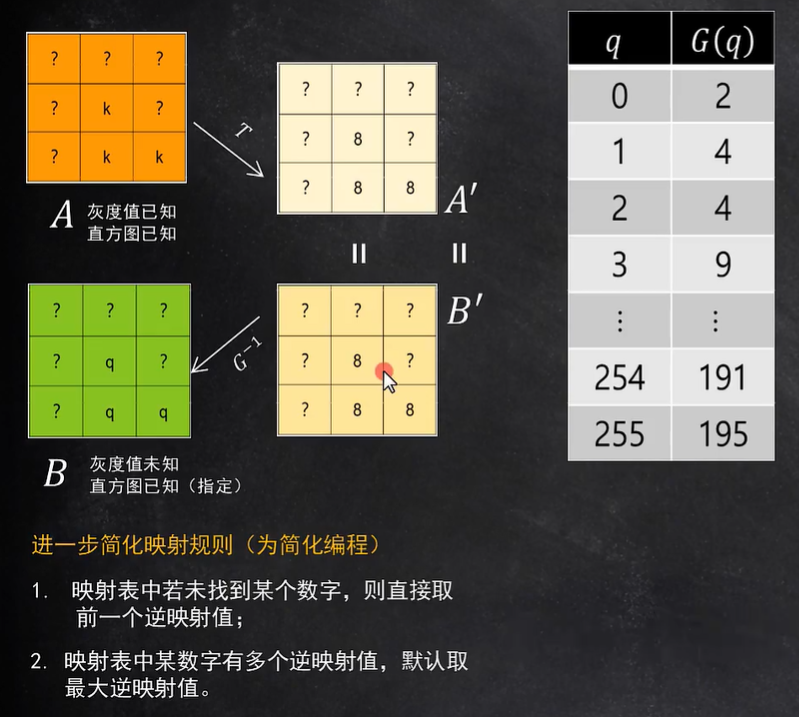

### 例子
将一个64*64大小的图进行直方图规定化

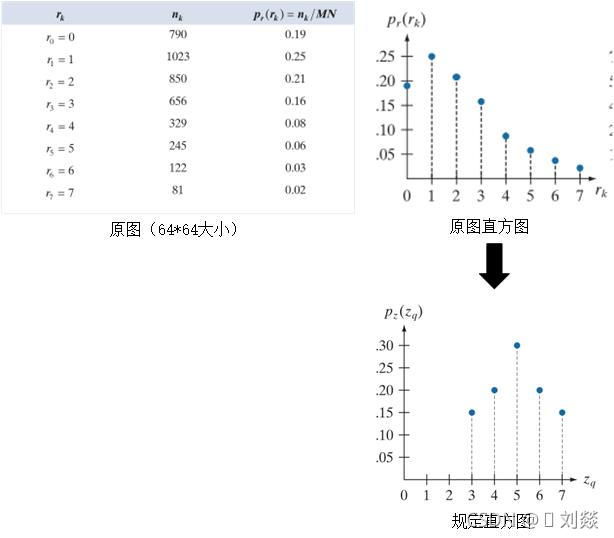

得到原图均衡化后的值并四舍五入

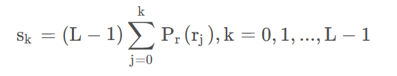

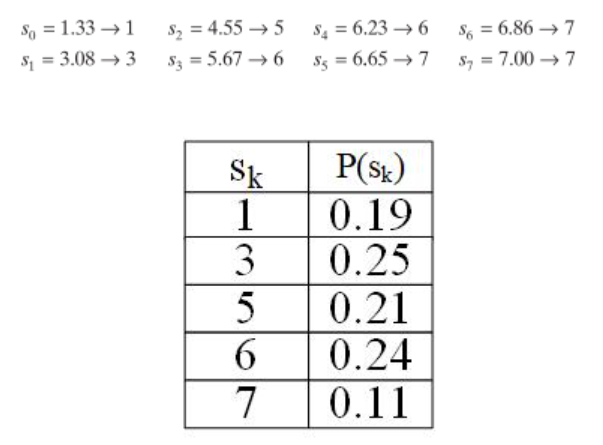

第二步：使用pz计算G(z)的值，公式和上方一样

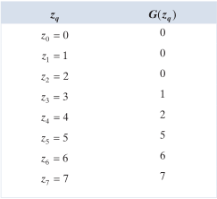

第三步：找sk和zq的映射（G的逆变换）

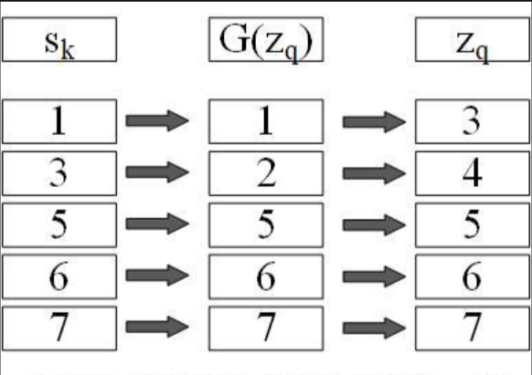

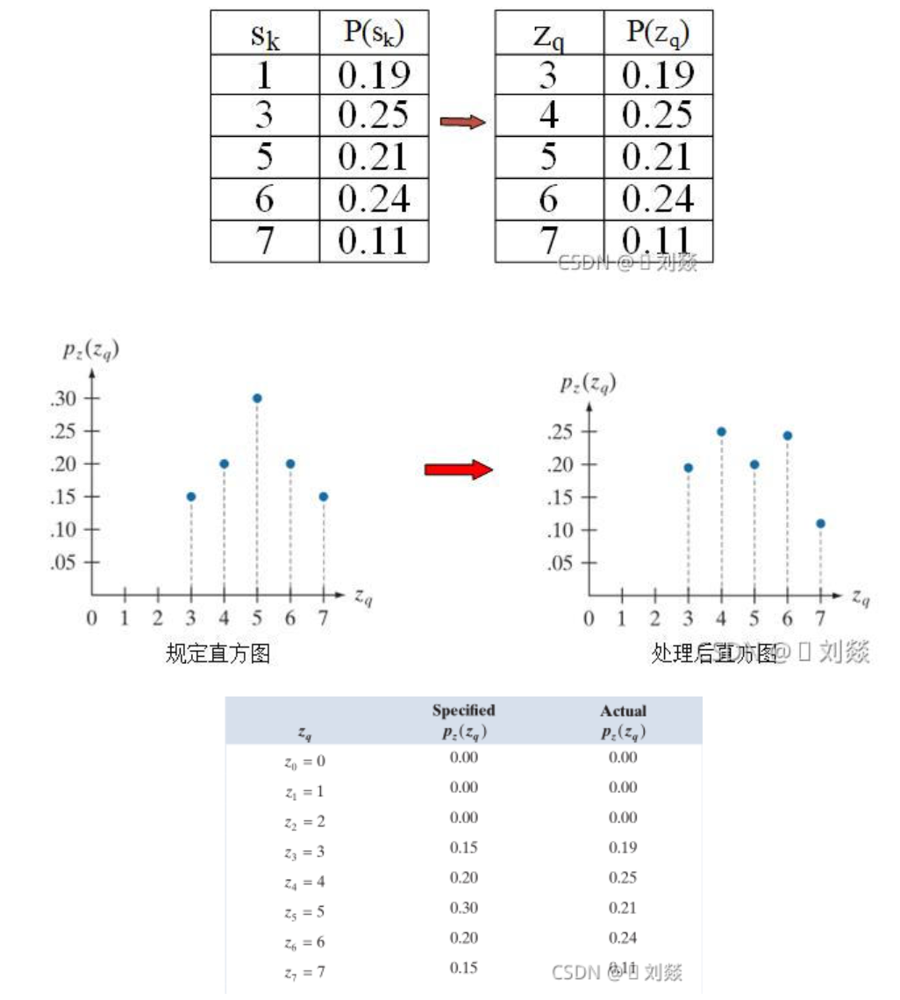

